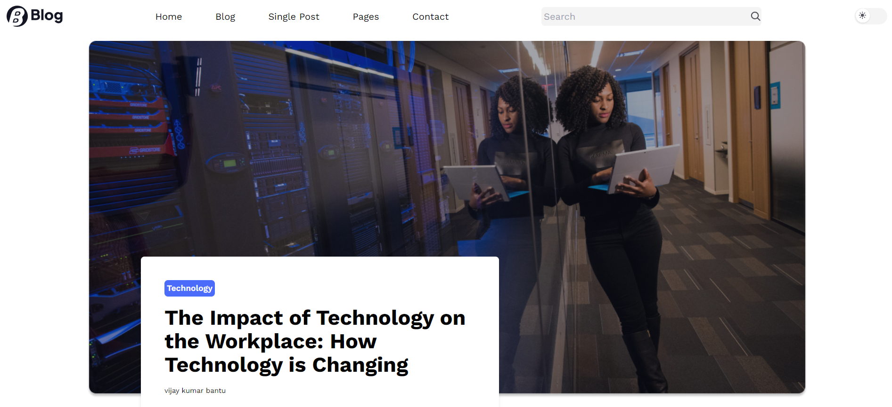
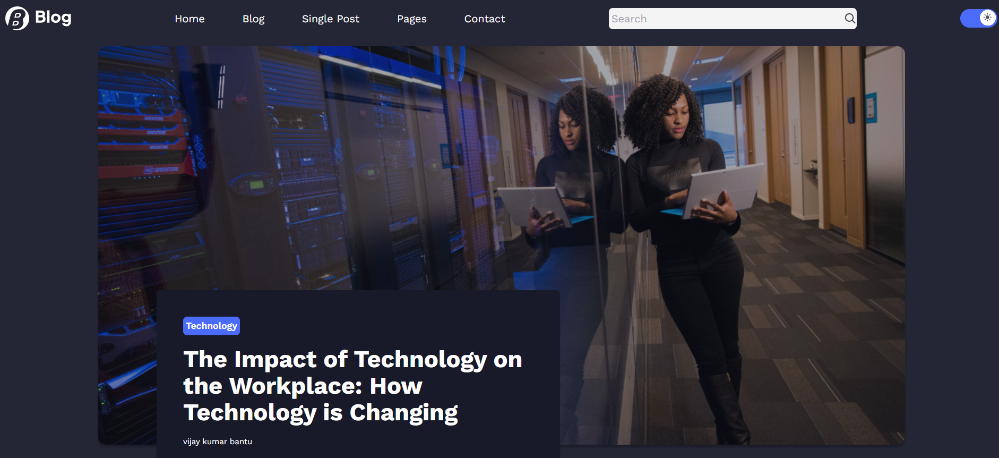

# My Blog Website

I have successfully designed and developed a frontend blog website using React.js, showcasing a significant enhancement in my frontend development skills with this technology. The project not only demonstrates my proficiency in React.js but also reflects my ability to create engaging and interactive user interfaces for web applications. Through this experience, I have gained valuable insights and hands-on experience that contribute to my growing expertise in frontend development with React.js.

This is just the home of the website, soon i will complete the whole website

## Tech Stack

- React js,TailwindCSS

## Authors

- [@vijay-kumar-bantu](https://www.github.com/vijay-kumar-bantu)

## Screenshots

## 🔗 Links

